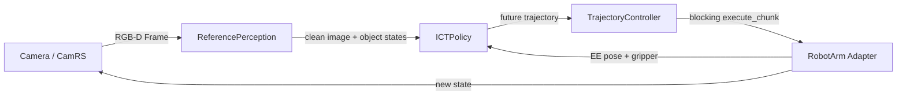
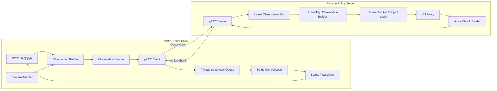
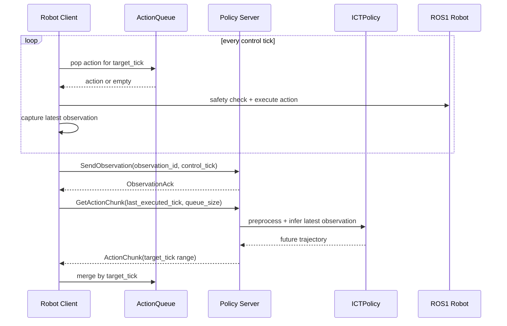
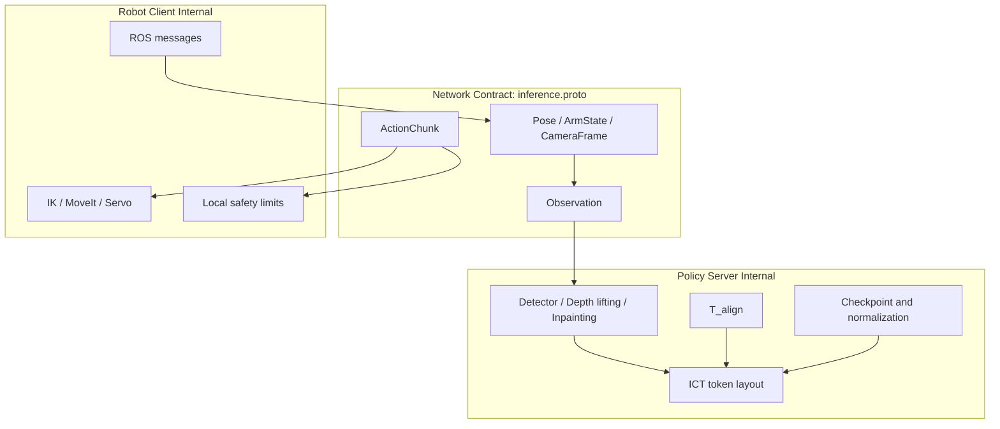

# 异步推理架构图

## A. 当前仓库的同步结构

当前代码主要集中在 `inference/run_inference.py`，推理和动作执行位于同一个循环中：

当前结构的问题是：

- 推理耗时期间无法持续执行动作。
- `execute_chunk()` 将控制、平滑、夹爪和等待放在同一调用中。
- 相机、感知、策略和机器人驱动的生命周期由一个脚本统一管理。
- 网络协议无法直接插入两个独立进程之间。

## B. 初版双端异步结构

## C. 一次异步控制周期

## D. 数据边界

网络层只传通用机器人状态、相机数据和时间索引动作。ROS 类型、ICT token、`T_align` 和 checkpoint 配置分别留在两端内部。

